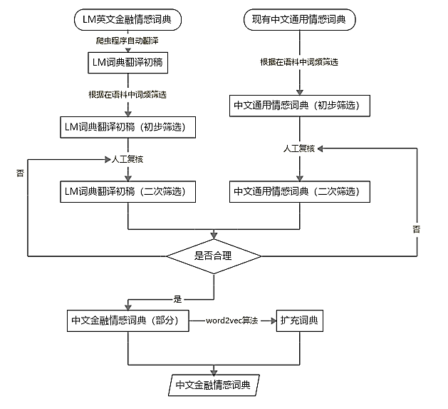

# 中文金融情感词典

本 GitHub 仓库上传了一款`中文金融情感词典`，该词典来自`姜富伟、孟令超、唐国豪，经济学（季刊），已接受待发表，媒体文本情绪与股票回报预测`。在尊重知识产权的前提下，读者可以免费使用该词典，请引用下列文献：
-  Fuwei Jiang, Joshua Lee, Xiumin Martin, and Guofu Zhou.“[Manager Sentiment and Stock Returns](https://www.sciencedirect.com/science/article/abs/pii/S0304405X18302770)” Journal of Financial Economics 132(1), 2019,126-149
- 姜富伟，孟令超，唐国豪. 媒体文本情绪与股票回报预测.经济学(季刊),已接受待发表.

## 词典构建方法

构建中文金融情感词典的两大素材是英文金融词典（LM词典）以及现有的中文通用情感词典，我们将把英文LM金融词典转化为对应的中文版本（`洋为中用`），并从中文通用情感词典中筛选出在金融语境下仍然适用的情感词汇（`古为今用`），这两部分词语是中文金融情感词典的重要组成部分。为了避免金融情感词语的遗漏，我们利用`word2vec算法`（一种深度学习算法）从语料中找到与前两部分词语高度相关并且具有合适情感倾向的词语，从而实现扩充词典的目的。最后，将上述三种方法得到的词语合并去除，得到最终的中文金融情感词典。在古为今用部分，为了避免不同通用情感词典之间特征差异的影响，同时也为了保证词语的完备性，我们将三个应用程度较为广泛的词典（知网HowNet情感词典、清华大军李军词典以及台湾大学NTUSD词典） 合并去重，以此作为所使用的通用情感词典。

## 词典信息

完整词典共9228个词语，其中消极词语共5890词，积极词语共3338词。

<table class="tg">
  <tr>
    <th class="tg-c3ow" colspan="3">消极词语部分 （5890）</th>
  </tr>
  <tr>
    <td class="tg-0pky">来源</td>
    <td class="tg-0pky"></td>
    <td class="tg-0pky">词语数量</td>
  </tr>
  <tr>
    <td class="tg-0pky">LM词典中文翻译</td>
    <td class="tg-0pky"></td>
    <td class="tg-0pky">1562</td>
  </tr>
  <tr>
    <td class="tg-0pky" rowspan="3">通用词典筛选</td>
    <td class="tg-0pky">Tsinghua词典</td>
    <td class="tg-0pky">1945</td>
  </tr>
  <tr>
    <td class="tg-0pky">知网词典</td>
    <td class="tg-0pky">534</td>
  </tr>
  <tr>
    <td class="tg-0pky">NTUSD词典</td>
    <td class="tg-0pky">1243</td>
  </tr>
  <tr>
    <td class="tg-0pky">Word2vec词典扩充</td>
    <td class="tg-0pky"></td>
    <td class="tg-0pky">606</td>
  </tr>
  <tr>
    <th class="tg-c3ow" colspan="3">积极词语部分 （3338）</th>
  </tr>
  <tr>
    <td class="tg-0pky">来源</td>
    <td class="tg-0pky"></td>
    <td class="tg-0pky">词语数量</td>
  </tr>
  <tr>
    <td class="tg-0pky">LM词典中文翻译</td>
    <td class="tg-0pky"></td>
    <td class="tg-0pky">458</td>
  </tr>
  <tr>
    <td class="tg-0pky" rowspan="3">通用词典筛选</td>
    <td class="tg-0pky">Tsinghua词典</td>
    <td class="tg-0pky">1928</td>
  </tr>
  <tr>
    <td class="tg-0pky">知网词典</td>
    <td class="tg-0pky">304</td>
  </tr>
  <tr>
    <td class="tg-0pky">NTUSD词典</td>
    <td class="tg-0pky">255</td>
  </tr>
  <tr>
    <td class="tg-0pky">Word2vec词典扩充</td>
    <td class="tg-0pky"></td>
    <td class="tg-0pky">393</td>
  </tr>
</table>

## 词语示例

下表中展示了中文金融情感词典三个来源中的代表性词语。LM词典中文翻译中的词语多为金融领域的专有词汇，与金融相关极为密切，这部分词语在通用情感词典中是极为少见的。通用情感词典筛选得到的词语则多为日常语境中常见的情感词汇，这些词汇在金融语境下仍然出现概率较大，而且情感意义保持一致，因此也被纳入到金融情感词典中。word2vec词典扩充得到的词语则为前两部分词语的有力补充。与LM词典中文翻译词语相比，这一部分词语与金融语境也有很强的相关性，但是词语的口语化与习语化特征更为明显，而LM词典的翻译词语则相对更加正式。通过表中词语特征，我们可以看出，LM词典中文翻译、通用情感词典筛选与word2vec词典扩充三部分词语特征差别较大，它们互为补充，共同构成了一个完善的中文金融情感词典。

<table class="tg">
  <tr>
    <th class="tg-0lax">词语倾向</th>
    <th class="tg-0lax">来源</th>
    <th class="tg-0lax">词语</th>
    <th class="tg-0lax">词语倾向</th>
    <th class="tg-0lax">来源</th>
    <th class="tg-0lax">词语</th>
  </tr>
  <tr>
    <td class="tg-0lax" rowspan="15">负向词语</td>
    <td class="tg-0lax" rowspan="5">LM词典中文翻译</td>
    <td class="tg-0lax">跌</td>
    <td class="tg-0lax" rowspan="15">正向词语</td>
    <td class="tg-0lax" rowspan="5">LM词典中文翻译</td>
    <td class="tg-0lax">涨</td>
  </tr>
  <tr>
    <td class="tg-0lax">被降级的</td>
    <td class="tg-0lax">晋升</td>
  </tr>
  <tr>
    <td class="tg-0lax">管理不善</td>
    <td class="tg-0lax">先发优势</td>
  </tr>
  <tr>
    <td class="tg-0lax">旷工</td>
    <td class="tg-0lax">独家经营</td>
  </tr>
  <tr>
    <td class="tg-0lax">漏税</td>
    <td class="tg-0lax">超额完成</td>
  </tr>
  <tr>
    <td class="tg-0lax" rowspan="5">通用情感词典筛选</td>
    <td class="tg-0lax">诽谤</td>
    <td class="tg-0lax" rowspan="5">通用情感词典筛选</td>
    <td class="tg-0lax">一帆风顺</td>
  </tr>
  <tr>
    <td class="tg-0lax">担心</td>
    <td class="tg-0lax">井然有序</td>
  </tr>
  <tr>
    <td class="tg-0lax">艰苦</td>
    <td class="tg-0lax">可靠的</td>
  </tr>
  <tr>
    <td class="tg-0lax">薄弱</td>
    <td class="tg-0lax">合法的</td>
  </tr>
  <tr>
    <td class="tg-0lax">惩罚</td>
    <td class="tg-0lax">完美</td>
  </tr>
  <tr>
    <td class="tg-0lax" rowspan="5">Word2vec词典扩充</td>
    <td class="tg-0lax">败下阵来</td>
    <td class="tg-0lax" rowspan="5">Word2vec词典扩充</td>
    <td class="tg-0lax">爱岗敬业</td>
  </tr>
  <tr>
    <td class="tg-0lax">变相涨价</td>
    <td class="tg-0lax">大好时机</td>
  </tr>
  <tr>
    <td class="tg-0lax">操作失误</td>
    <td class="tg-0lax">高回报</td>
  </tr>
  <tr>
    <td class="tg-0lax">炒鱿鱼</td>
    <td class="tg-0lax">绝对优势</td>
  </tr>
  <tr>
    <td class="tg-0lax">大跌眼镜</td>
    <td class="tg-0lax">可喜成绩</td>
  </tr>
</table>

---------
更多细节请参见论文：`姜富伟、孟令超、唐国豪，经济学（季刊），已接受待发表，媒体文本情绪与股票回报预测`.
